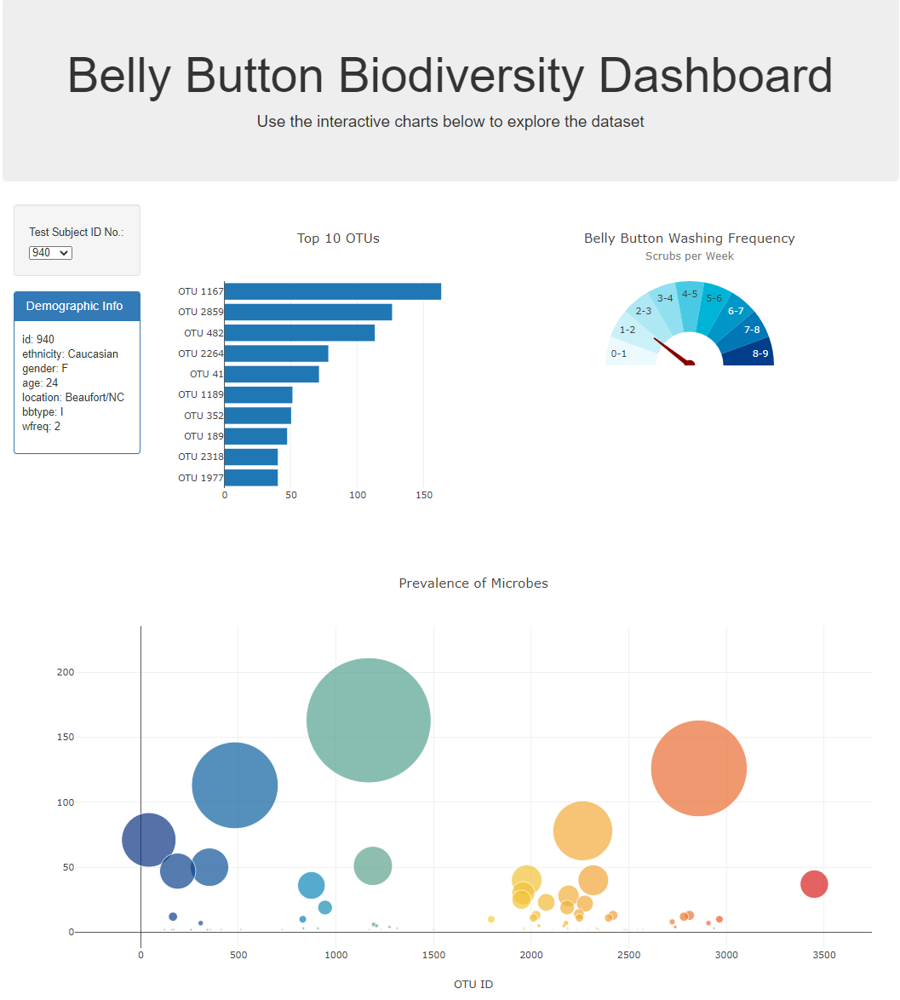

### plotly-challenge
# Belly Button Biodiversity

## Overview

The purpose of this challenge is to build an interactive dashboard to explore belly button biodiversity data, which catalogs the microbes that colonize human navels. Several plots are included on the dashboard--a bar chart to show the top 10 OTUs found in the chosen test subject's belly button, a gauge chart to show the washing frequency, and a bubble chart to display each sample found in that individual. There's also a some demographic information displayed about that individual test subject. There's a dropdown of all the test subjects so choosing one updates all the plots on the page.

### Files and Folders

* [Main Page](index.html) - this *index.html* file is the page that opens in the Browser; this page is the dashboard that, when first opened, shows the data for just Test Subject ID 940. Data for different test subjects is show by selecting one of the entries in the *Test Subject ID No. * dropdown on the left side of the dashboard.
* [data](data/) - this folder holds the belly button biodiversity dataset file
    * [samples.json](data/samples.json) - this *JSON* file contains the belly button biodiversity data used to source the dashboard
* [static](static/) - this folder holds two subfolders--css and js
    * [css](static/css/) - this folder holds the *style.css* file that helps format the webpage
    * [js](static/js/) - this folder holds the the *JavaScript* file
        * [app.js](static/js/app.js) - this file contains the *JavaScript* script that manipulates the *HTML* page

## Development and Analysis

### Steo 1 - Plotly

We started out with an HTML page that had the `
` tags for the various plots that needed to be added and the Demographic Info as well as the `<section>` tags for the dropdown. We also had the *samples.json* file for the data and an empty *app.js* file to hold our script. First I rearranged the files we were given into a little different folder structure. I left the *index.html* file at the root since this needed to be deployed to *GitHubPages*. It seemed like the data file should not be in that root folder so added a *data* folder and moved it there. Created a *static* folder to hold the *css* folder should I need to create a *style.css* file (which I eventually did) and the *js* folder into which I put the *app.js* file.

With the folder structure set and the files moved, next step was to start tackling the code. Got the connection to the data working and pulling. With the dashboard needing to be populated with something when it first opens, created an `init()` function and put the connection information inside that. Since everything in the dashboard revolves around the dropdown list of test subject ids, the next step was to get that created and populated. Did that by appending `<option>` tags to the `<select>` tags with an id of `selDataset`. Once that was populating, I decided to use the first Test Subject ID as the default when the page opens initially. So captured that value in a variable to be used later in the `init()` function code. 

Then I moved on to the *Demographic Info* section. Was going to make this a table at first glance but an unordered list without the bullets seemed like a better fit so I went that route. I did run into some issues with the text and the margins so ended up resolving that by adding a *style.css* file and putting the style information in there regarding `<ul>` tags. Actually added it directly to the *index.html* file first but when I needed the *CSS* file for the gauge chart, I added the *style.css* file and put the code in there as well.

At this point I moved on to the *Level 2* challenge. However, later I re-read the rubric and saw that the table should re-render with the filtered data. The way I solved it didn't re-render the table, it just hid non-matching rows. So I ended up reworking things, scrapped the hide/show rows approach, and figured out how to get the table re-renedered with just the filtered data. The end result is below:

## Notes

Set Test Subject ID 940 as the default for when the page opens. It's the first one in the list so seemed like the natural choice to use for the default. That way, when the user uses the dropdown list for the first time, all the choices are listed below instead of potentially having to scroll up the list as well.

I used *newPlot* for each plot in the *optionChanged* function instead of *restyle*. At first it seemed like *restyle* should be used because the plots already existed. But there wasn't anything to update, the underlying data was changing but none of the attributes were so *newPlot* seemed like the better route.

folder layout

gauge and wash frequencies not in degrees- size of gauge

I'm amazed at how many times I used `console.log()` and the amount of time analyzing results in *Google Inspector*. Both were invaluable for this challenge. Didn't realize how much I was looking at through *Google Inspector* until I was cleaning up my script at the end and having to delete `console.log()` over and over again.
